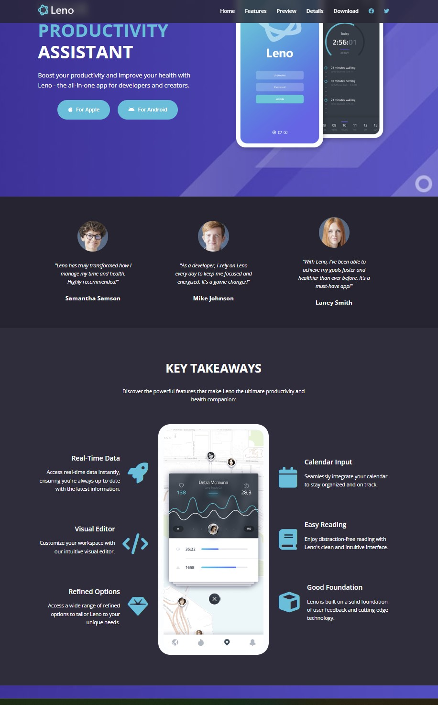
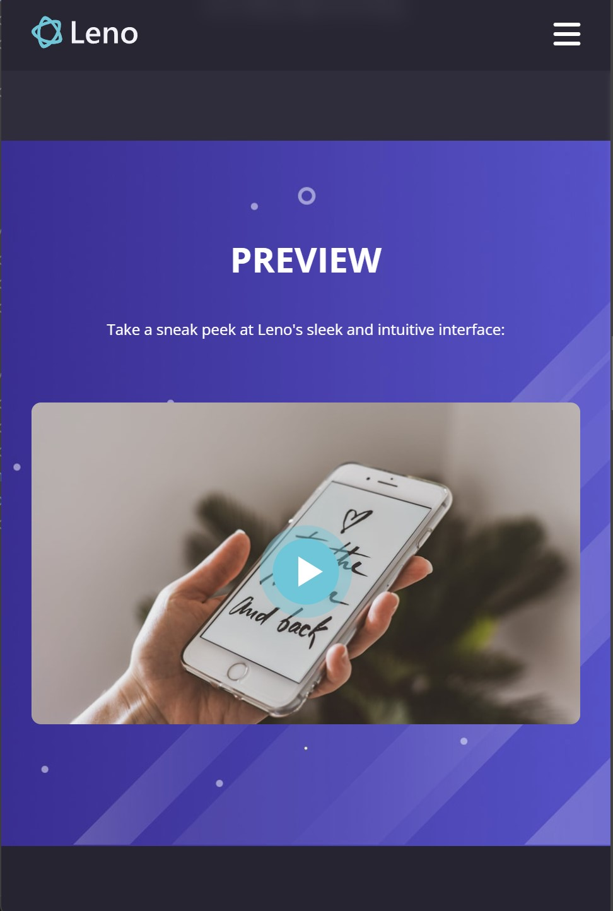

# LENO - Web Application

This the resulting Web Application from Traversy Media course HTML & CSS, LENO project.

This is a solution to the [Intro section with dropdown navigation challenge on Frontend Mentor](https://www.frontendmentor.io/challenges/intro-section-with-dropdown-navigation-ryaPetHE5). Frontend Mentor challenges help you improve your coding skills by building realistic projects.

## Table of contents

- [Overview](#overview)
  - [The challenge](#the-challenge)
  - [Screenshot](#screenshot)
  - [Links](#links)
- [My process](#my-process)
  - [Built with](#built-with)
  - [What I learned](#what-i-learned)
  - [Continued development](#continued-development)
  - [Useful resources](#useful-resources)
- [Author](#author)
- [Acknowledgments](#acknowledgments)

**Note: Delete this note and update the table of contents based on what sections you keep.**

## Overview

### Summary

The Web Application consists of a main page and a details page.
Both pages use same Navbar, Footer.

The main page include the following:

- Hero section
- Testimonials section
- Features section
- Video Modal, -
- Preview section
- Details section
- Screenshots section-
- Download section.

The details page include the following:

- Pricing section
- Feature Details section

The Web Application is built with HTML, CSS and a little Javascript for handling video modal and mobile menu. The CSS is structured according to the BEM methology. Grid layout as well as Flexbox is used in different sections

The Web application is 1100px wide and have media queries 998px and 768px (mobile)

### Screenshot of desktop view

### Screenshot of mobile view

### Link to LENO Website

## Author

Peter Welliver

- Website - [Add your name here](https://www.your-site.com)
- Frontend Mentor - [@yourusername](https://www.frontendmentor.io/profile/yourusername)
- Twitter - [@yourusername](https://www.twitter.com/yourusername)
